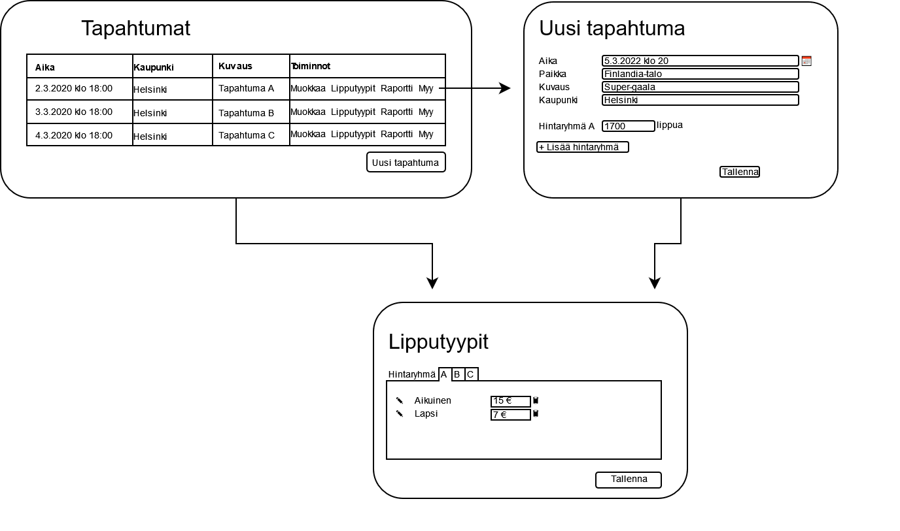
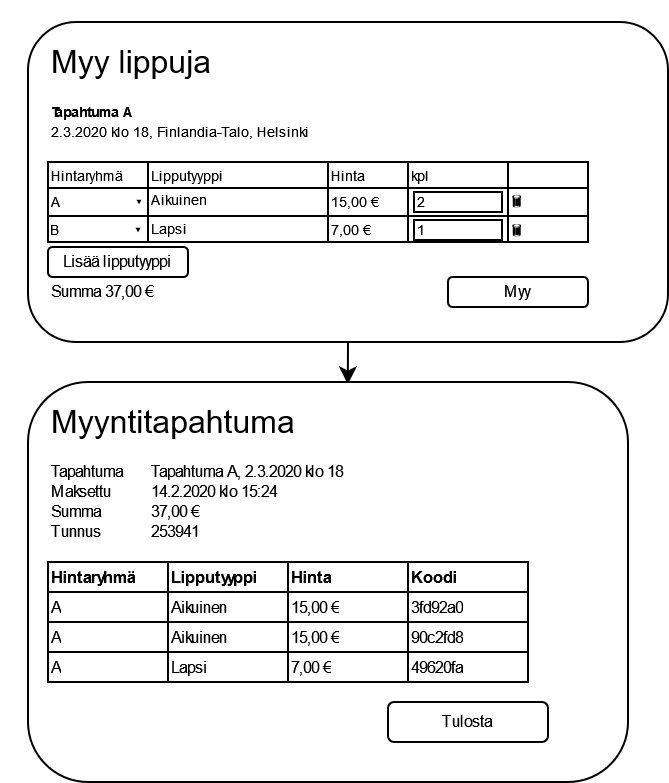
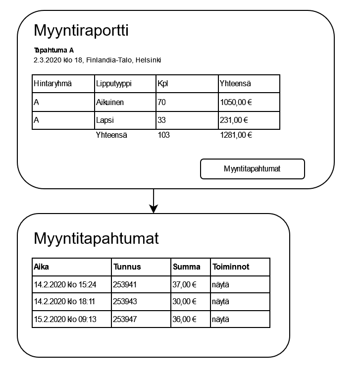
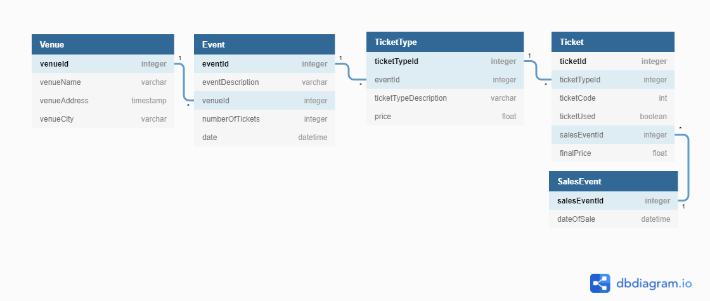

# TicketGuru

Tiimi:
* Jukka Silkosuo
* Jori Kemppi
* Jimi Kurko
* Miska Routio

## Johdanto

TicketGuru on lipunmyyntijärjestelmä joka on tarkoitettu lippujen myymiseen asiakkaan myyntipisteessä. TicketGurun tilaajana toimii **LippupalveluX**.
Järjestelmä toteutetaan Spring Boot-frameworkissä Javalla ja siinä käytetään PostgreSQL-tietokantaa.

Myyntijärjestelmä toteutetaan desktopympäristöön sekä lippujen tapahtumassa tarkistusta varten mobiiliin.

Lipunmyyntijärjestelmällä on tarkoitus:
* määritellä ja lisätä tapahtumia järjestelmään
* myydä lippuja tapahtumiin lipunmyyntipisteessä asiakkaille
* tulostaa lippuja myytäväksi tapahtuman ovella
* sisällyttää lippuihin tapahtuman ovella luettava QR-koodi, jolla merkitä ne käytetyiksi

## Järjestelmän määrittely

TicketGurun käyttäjäroolit:
* Admin; esihenkilö tms ylempi henkilö joka vastaa tapahtumien myynnistä
* Lipunmyyjä, asiakkaiden kanssa tekemisissä oleva myyjä joka myy tapahtumaliput
* Lipuntarkastaja; tapahtumassa oleva työntekijä joka tarkastaa ostetut liput ja myy tulostettuja lippuja

### Käyttäjätarinat käyttäjärooleittain

Yleistä
* Tietokannan (SQL) luominen projektille, mihin muualta järjestelmästä voidaan tehdä muutoksia.
* Tulostettujen lippujen pitäisi jokaisen sisältää uniikki koodi(QR?) jonka avulla lipun ostanut asiakas pääsee tapahtumaan.
* Järjestelmällä pitäisi olla yksinkertainen kirjautumissysteemi jota kautta lipunmyyjät, adminit ja lipuntarkastajat pääsevät kirjautumaan järjestelmään.

Lipunmyyjä
* Lipunmyyjänä haluaisin päästä tarkastelemaan tarjolla olevia tapahtumia järjestelmän kautta jotta tiedän mitä lippuja myydä. A1
* Lipunmyyjänä haluaisin myydä X määrän lippuja aikuiselle/lapselle jotta pääsen tekemään työtäni. A2
* Lipunmyyjänä haluaisin tulostaa myymäni lipun/liput asiakkaalle jotta asiakas saa ostamansa tuotteen. A3
* Lipunmyyjänä haluaisin ennakkomyynnin päätyttyä helposti tulostaa kaikki myymättömät liput jotta niitä päästään myymään fyysisesti tapahtuman ovilla. A4

Admin
* Adminina haluaisin pystyä lisäämään järjestelmään tapahtumia jotta lipunmyyjällä olisi töitä. B1
* Adminina haluaisin pystyä asettamaan tietylle tapahtumalle lippujen myyntimäärän jotta olisi jotain mitä myydä. B2
* Adminina haluaisin pystyä asettamaan tapahtuman aikuisten sekä lasten lipuille erilliset hinnat. B3
* Adminina haluaisin pystyä muokkaamaan jotain tapahtumaa (asettamaan uuden ajan/muokkaamaan kaupunkia/muuttamaan kuvausta tai nimeä) B4
* Adminina haluaisin järjestelmän luomaan jokaista tulostettua lippua kohden uniikin koodin jotta asiakas pääsee lipullaan koodia vastaan tapahtumaan. B5
* Adminina haluaisin päästä tarkastelemaan myyntiraporttia jokaisesta tapahtumasta, josta selviää kaikki myynnit ja kaikki myyntitapahtumat yksityiskohtineen (aika, nro ja summa). B6

Lipuntarkastaja
* Lipuntarkastajana haluan pystyä tarkastamaan tapahtuman ovella, että asiakkaan lippu on oikea ja aito kyseiseen tapahtumaan. C1

## Käyttöliittymä

Tapahtumaa luotaessa käyttäjä voi lisätä hintaryhmiä (esimerkiksi katsomon alueita), ja merkitä kuhunkin hintaryhmään, montako lippua kyseiseen hintaryhmään myydään. Lipputyyppejä lisätessä kukin hintaryhmä on omalla välilehdellään, ja hintaryhmän välilehdellä voi määritellä, mitä kukin lipputyyppi (esim. aikuinen, lapsi, opiskelija) maksaa kyseisessä hintaryhmässä.

"Lisää lipputyyppi" luo taulukkoon uuden rivin, johon käyttäjä voi pudotusvalikosta valita hintaryhmän ja lipputyypin.

## Tietokanta

Järjestelmän tietokanta toteutetaan ylläolevan kaavion mukaisesti. Tieto on strukturoitu järjestelmässä Java-luokkiin, joista tietoa voidaan luoda, poistaa ja muuttaa palvelimella pyörivään PostgreSQL-relaatiotietokantaan.

## REST API

TicketGurun Rest API vastaanottaa ja lähettää tietokannan dataa JSON muodossa listattuna.

* [Tapahtumat](Events.md)
* [Tapahtumapaikat](Venues.md)